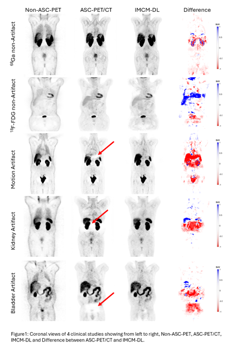

# Deep Learning-Based PET Image Correction Toward Quantitative Imaging

## Introduction
This repository contains the code and documentation for the  master thesis project, which focuses on developing a deep learning model to correct attenuation and scatter corrections without anatomical inforamtion from CT, also detect and correct artefacts in <sup>68</sup>Ga-PET imaging. In this thesis, we have demonstrated the efficacy of an Integrated multi-center Dynamic Unet DL framework for artifact detection and correction in PET imaging of <sup>68</sup>Ga-labelled compounds. The approach leverages large datasets from multiple centers, to achive a universal model for same radiotracer but different centers. Through the incorporation of transfer learning concepts, we have developed radiotracer-specific models that significantly outperform those based on specific radiotracers, thereby addressing a major limitation in the field of medical imaging.
*Our model effectively detected and corrected artifacts.* This enhancement is vital for making therapeutic decisions in the field of oncology, where PET imaging plays a central role in diagnosing, planning treatments, and evaluating responses. By using Dyn-Unet architecture and other advanced DL techniques, our method has not only improved image quality but also greatly decreased the appearance of common artifacts like halo and mismatch artifacts, especially in <sup>68</sup>Ga-PET imaging. The effective implementation of our models in different centers highlights their resilience and flexibility, which are essential for general acceptance in clinical settings.

## Objectives
In this study we tried to take a step into the problematic field of correction in PET imaging artefacts, with especially high-prevalence ones: mismatch and halo artefacts in <sup>68</sup>Ga PET imaging. The aim of this paper is to look at several deep learning models and methodologies to design a multi-centre model that allows un-direct data sharing at each centre due to some demerits of conventional deep learning techniques.
We will use our approach to estimate and compare the performance of models under both strategies within different radio tracer distributions and multi-centre data environments.
This research will aim to be a demonstration of the possibility, as well as the superior performance, of the deep learning models for real clinical settings, which will potentially set a new standard of CT-free PET imaging that enhances diagnostic accuracy while minimising radiation exposure and procedural complexity.

## Models
- **Integrated Multi-Center Model (IMCM)**: Combines data from multiple centers to enhance model generalization.
- **Anatomy-Dependent Correction Model (ADCM)**: Focuses on correcting attenuation and scatter based on anatomical features.
- **Tuned Transfer Learning Model (TL-MC)**: Addresses the variability across different radiotracers.

## Project Structure
- `src/`: Source code for the deep learning models and utility functions.
- `data/`: Sample data files (note: due to privacy, actual patient data are not included).
- `Archive/`: Archived notbooks nessasary for further investigation.
- `Analysis/`: Archived notbooks about data pre processing, statistical testing and so on.
- `Other_Models/`: Archived models notbooks we could'nt get good results or needing for further progress.
- `info/`: Documentation and additional notes on the project.
- `Results/`: Analysis output, plots, model structure and images used in the thesis for demonstration, such as artefact corrections.


## Setup and Installation
Ensure you have Python 3.8+ installed, then run:
```bash
pip install -r requirements.txt
```

Usage
To train the model:
```bash
python src/main.py
```

To evaluate the model:
```bash
python Inference.ipynb
```

To use the application:
```bash
streamlit run dashboard.py
```


## Results
This project achieved notable improvements in artefact detection and attenuation/scatter correction. Refer to the results/ directory for detailed performance metrics and visual results.

### Artifact Correction Demonstration

This section showcases the results of the artifact correction applied using the IMCM model:



The following demonstrates an animation of CT-based ASC of images (left) and their DL (right). Look at the differences, which are artifact-corrected in the DL version showing with red-color:
(/students/2023-2024/master/Shahpouri/DL_PET/info/artifact2.gif)

## License
This project is licensed under the MIT License - see the LICENSE.md file for details.


## Acknowledgments

### Thesis Supervisors
[Dr. Isaac Shiri](https://www.linkedin.com/in/isaac-shiri-8267936a/)

[Dr. Dave Langers](https://www.linkedin.com/in/landsgevaer?lipi=urn%3Ali%3Apage%3Ad_flagship3_profile_view_base_contact_details%3BerFYPiYaQHiiIPvgurheWQ%3D%3D)

### Data contributors
[Artificial Intelligence in Cardiac Imaging Laboratory, Inselspital, Bern University Hospital, Switzerland](https://inselgruppe.ch/de/die-insel-gruppe)

[Hanze University of applied science, Groningen, The Netherlands](https://www.hanze.nl/nl)

### Contact
Author: [Sama Shahpouri](https://www.linkedin.com/in/zohreh-shahpouri/)

Email: [z.shahpouri@gmail.com]

