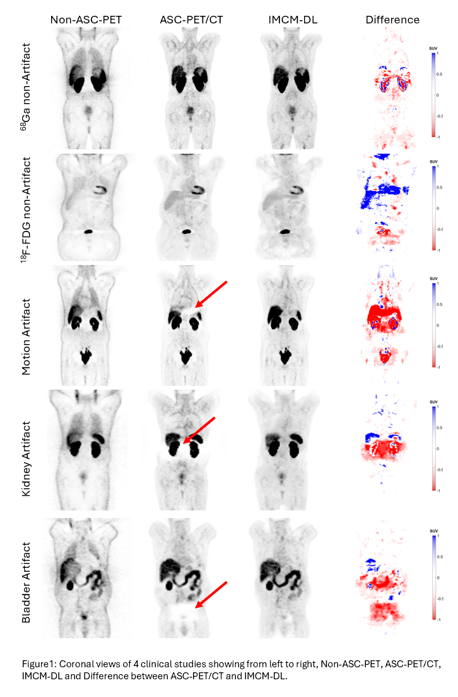

# Deep Learning-Based PET Image Correction Toward Quantitative Imaging

## Introduction
This repository contains the code and documentation for my thesis project, which focuses on developing a deep learning model to detect and correct artefacts in 68Ga-PET imaging. The model leverages federated transfer learning to enhance privacy preservation and improve the quality of PET images by addressing specific imaging artefacts such as halo and scatter effects.

## Objectives
In this study we tried to take a step into the problematic field of correction in PET imaging artefacts, with especially high-prevalence ones: mismatch and halo artefacts in 68Ga PET imaging. The aim of this paper is to look at several deep learning models and methodologies to design a multi-centre model that allows semi- and un-direct data sharing at each centre due to some demerits of conventional deep learning techniques. This is made possible using a novel deep learning architecture called Dyn-Unet with a sophisticated 3D convolutional capability, allowing for precise disentangling and correction of artefacts.
We will use our approach to estimate and compare the performance of models under both strategies within different levels of tracer dynamics and multi-centre data environments. In particular, we will integrate domain expertise into our deep learning framework in order to detect and correct artefacts more efficiently in multi-centre studies.
This research will aim to be a demonstration of the possibility, as well as the superior performance, of the deep learning models for real clinical settings, which will potentially set a new standard of CT-free PET imaging that enhances diagnostic accuracy while minimising radiation exposure and procedural complexity.

## Models
- **Integrated Multi-Center Model (IMCM)**: Combines data from multiple centers to enhance model generalization.
- **Anatomy-Dependent Correction Model (ADCM)**: Focuses on correcting attenuation and scatter based on anatomical features.
- **Tuned Transfer Learning Model (TL-MC)**: Addresses the variability across different radiotracers.

## Project Structure
- `src/`: Source code for the deep learning models and utility functions.
- `data/`: Sample data files (note: due to privacy, actual patient data are not included).
- `docs/`: Documentation and additional notes on the project.
- `images/`: Images used in the thesis for demonstration, such as artefact corrections.
- `notebooks/`: Jupyter notebooks illustrating the model training and evaluation process.

## Setup and Installation
Ensure you have Python 3.8+ installed, then run:
```bash
pip install -r requirements.txt
```


Usage
To train the model:
```bash
python src/train_model.py
```

To evaluate the model:
```bash
python src/evaluate_model.py
```

Results
This project achieved notable improvements in artefact detection and attenuation correction. Refer to the results/ directory for detailed performance metrics and visual results.

## Artifact Correction Demonstration

This section showcases the results of the artifact correction applied using the IMCM model:



The image above illustrates the correction of scatter and halo artifacts in PET imaging, enhancing the clarity and diagnostic accuracy of the scans.

## License
This project is licensed under the MIT License - see the LICENSE.md file for details.


## Acknowledgments

### Thesis Supervisors
[Dr. Isaac Shiri](https://www.linkedin.com/in/isaac-shiri-8267936a/)

[Dr. Dave Langers](https://www.linkedin.com/in/landsgevaer?lipi=urn%3Ali%3Apage%3Ad_flagship3_profile_view_base_contact_details%3BerFYPiYaQHiiIPvgurheWQ%3D%3D)

### Data contributors
[Artificial Intelligence in Cardiac Imaging Laboratory, Inselspital, Bern University Hospital, Switzerland](https://inselgruppe.ch/de/die-insel-gruppe)

[Hanze University of applied science, Groningen, The Netherlands](https://www.hanze.nl/nl)

### Contact
Author: [Sama Shahpouri](https://www.linkedin.com/in/zohreh-shahpouri/)

Email: [z.shahpouri@gmail.com]

